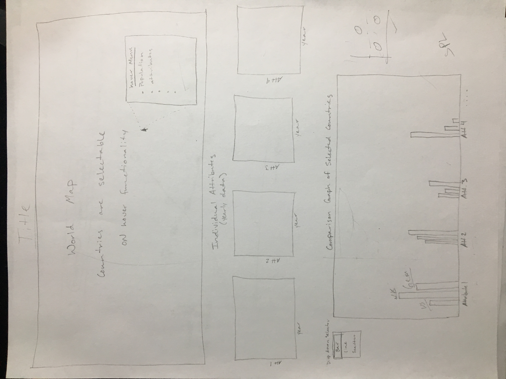
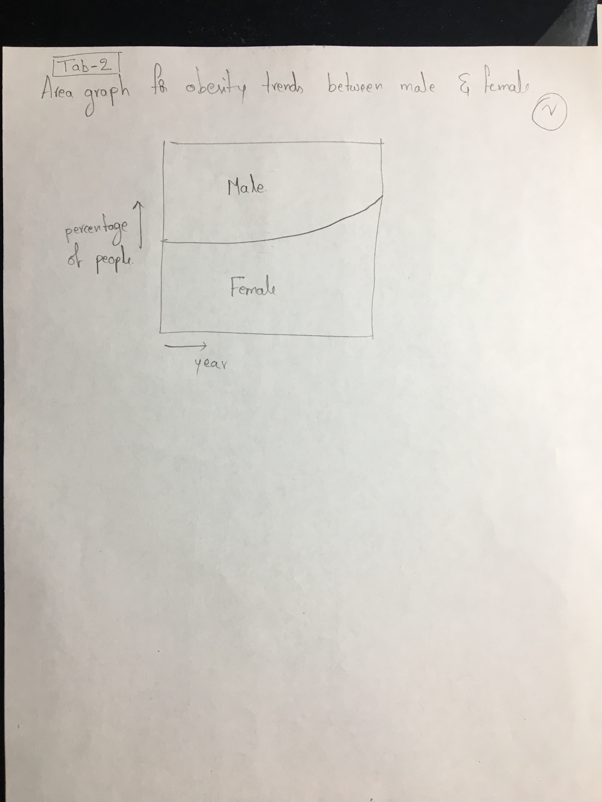
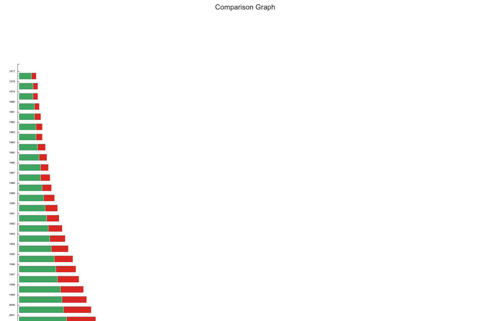
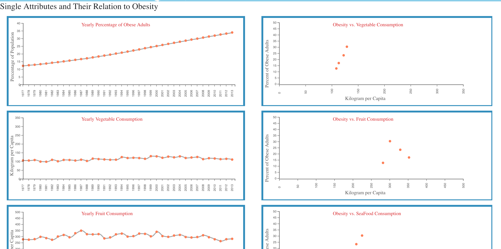

**CS5890 Final Project - Team VisualSeekers**
-
  

  

**Basic Info:**

  

  

Project Name: Factors Affecting Obesity Worldwide

  

Team name: Visual Seekers

  

Team Members:

  

Aditi Maheshwari, aditimaheshwari93@gmail.com

  

Jarom Wilcox, wiljar00@gmail.com

  

Pratyusha Sai Kamarouthu, kpratyushasai@gmail.com

  

Github Repository: [https://github.com/wiljar00/VisualSeekers](https://github.com/wiljar00/VisualSeekers)

  

  ---
  

**Background and Motivation:**

  

  

Obesity is currently a rising threat to the world population. There could be many different factors contributing to the rise of obesity and we would like to take a further look into the causes and effects of this epidemic. Obesity is apparent in many places throughout the world, so we are creating a visualization to better view the data collected throughout the world’s many countries and possibly identify trends. This visualization will provide insights into the factors that affect obesity and could help identify possible solutions. There are different lifestyle choices and diet compositions that could potentially aid in battling obesity and we feel that this will be an effective tool to identify solutions. Finding possible solutions to this worldwide epidemic would make this world a better place, which is our main motivation for this visualization.

  
---
  

**Project Objectives:**

  

  

There are several questions that we are attempting to answer with this visualization. The primary questions we are looking to answer are as follows:

  

  

What diet related factors affect obesity?

  

Where in the country is obesity the most severe and why?

  

How do certain countries’ diets affect obesity rates?

  

What is the relationship between certain foods and obesity?

  

Are there any factors that reduce obesity in the world?

  

  

We would like to learn of the correlations between the attributes we have selected and obesity rates. Hopefully, we will be able to identify trends between certain foods or lifestyles and obesity. Identifying these relationships will help us in our personal lives and also help others identify issues in their own lives. We would like to find factors that clearly affect obesity rates.

  

  

The benefits of this study are numerous. As previously mentioned, obesity is a rising threat that is negatively affecting the world’s population. It is affecting different parts of the world at different rates and the visualization we are creating would help identify why this is happening. Identifying causes of obesity would help battle the epidemic. Finding factors that prevent obesity would be a great benefit to the world. These are a few of the benefits we would like to find by creating this visualization.

  
---
  

**Data:**

  

  

The dataset we will be using is a combination of datasets collected from the worldwide database of ourworldindata.org. We will use the previously collected data to create our own visualizations of the relationships between these datasets.

  

  

The datasets we will use are as follows:

 
* Worldwide database: [https://ourworldindata.org/](https://ourworldindata.org/happiness-and-life-satisfaction)

  

* Obesity: [https://ourworldindata.org/obesity](https://ourworldindata.org/obesity)

  

* Fruit and Vegetable consumption: [https://ourworldindata.org/diet-compositions](https://ourworldindata.org/diet-compositions)

  

  

* Meat and seafood consumption: [https://ourworldindata.org/meat-and-seafood-production-consumption](https://ourworldindata.org/meat-and-seafood-production-consumption)

  

  

* Overall fat consumption: [https://ourworldindata.org/diet-compositions](https://ourworldindata.org/diet-compositions)

  

  

* Average Body Mass Index: [https://ourworldindata.org/hunger-and-undernourishment](https://ourworldindata.org/hunger-and-undernourishment)

  

  

* Life Expectancy: [https://ourworldindata.org/life-expectancy](https://ourworldindata.org/life-expectancy)

  
---
  

**Data Processing:**

  

  

We plan on doing substantial data cleanup in creating this visualization. Our data is provided through CSV files, but we will need to combine different datasets to create our relationship graphs. We will remove unwanted data and attributes from these CSV files and combine others. There will be missing data from certain countries throughout this combined dataset and we will need to clean up these missing values. We will remove unwanted years and dates from these datasets as well.

  

  

The attributes we will use to create our visualization are: obesity, fruit and vegetable consumption, meat and seafood consumption, overall fat consumption, average body mass index, and life expectancy. To process our data, we will be manually combining these CSV files and using them together to enable access as needed throughout use of this visualization.

  
---
  

**Visualization Design:**

  

  

To display our data, we will begin by showing a map of the world at the top of the visualization. This map will be used as a selector for certain datasets. Functionality will be added to each country of which we have sufficient data. When the user clicks on a country, the dataset will be loaded.

  

  

After the country is selected on the world map, there will be several line graphs on the left side if the page. These line graphs will show the data of individual attributes over the total years. This will enable us to show potential trends or changes of each attribute over time. There will be a graph for each individual attribute in our database. Using the hover feature, we will be able to view exact values on these line graphs. This is for the user to get a baseline reading of the information before looking at any comparison.

  

  

The next part of the display will have a comparison box with selectable attributes. It will be larger than the individual attribute graphs and will have additional functionality. The user will be able to select which countries (using the map) and multiple attributes (using a drop-down menu or tabs) to view how these attributes relate throughout different countries. This will be either a scatterplot or an area chart. If possible, both graph options will be available. This section of the visualization will be the most interactive section and will provide the most insights.

  

  

There will be additional features as well. When hovering over each country, there will be additional information shown in a hover or slider menu. This will be displayed according to the data available in our datasets. There will also be baseline identifiers on the line graphs to show the same relative time between graphs. More attributes may be possibly be added if deemed necessary. The extensible portion of this visualization creation is the number of attributes. Overall, we should be able to identify trends and relationships between attributes using the main graphs and also view other country information if desired.

  
---
  

**Must-Have Features:**

  

There are several essential features of this visualization. We must have a map for selecting the desired countries to compare. There must be functionality to select these countries and load their datasets. We must have the single attribute line graphs showing the trends of each attribute throughout the years. We also must have some form of comparison visualization or graph completed. This is where the user will be able to easily identify trends between attributes. These features must be completed to be considered a complete project.

  
---
  

**Optional Features:**

  

  

After the essential features are completed, there are many optional features that could be added. The slider/hover menu showing information of each country selected is a non-essential option. Additional comparison graphs implemented throughout different tabs would be an optional feature. A scatterplot of attribute data by selected countries may be added to show additional information. Multiple selection options may be implemented for selecting countries and attributes for the comparison maps. Additional functionality to the comparison graph could be added using different selectors and formats. Transitions may be added to help view the change in datasets and provide context for new data.

  
---
  

**Project Schedule:**

  

  

*Week 1:*

  

  

*Goals:*

  

Our main goal is to have the structure built and HTML set up with appropriate “div” ids for separation of group work. Also we must have a workable dataset completed by the end of this week.

  

  

*Tasks:*

  

Jarom will help in setting up the HTML page with appropriate “div” sections and their IDs to help enable the separation of future tasks.

  

  

Aditi will work on the design of the main HTML page and set up the appropriate CSS elements.

  

  

Pratyusha will work on collecting and cleaning up the datasets. She will get at least one CSV file ready to be used in the visualization.

  

  

As team members finish their tasks, they will spend any additional time helping create a workable dataset for the visualization.

  

  

*Week 2:*

  

  

*Goals:*

  

Our goals for this week will be to finish the functionality of selecting countries from the world map and create the single attribute charts. Also we will be finishing the prototype for presentation.

  

  

*Tasks:*

  

Jarom will work on finishing the map selection functionality and work on prototype requirements.

  

  

Aditi will work on creating several single attribute charts.

  

  

Pratyusha will work on creating the remaining single attribute charts.

  

  

*Additional tasks:*

  

Finish prototype and make ready the visualization for presentation.

  

  

*Week 3:*

  

  

*Goals:*

  

Our goals for this week will be to add a comparison chart to the bottom of the visualization and add styling options to the created graphs.

  

  

*Tasks:*

  

  

Jarom will work on styling issues including a map color scale and slider/hover menu.

  

  

Aditi will work on creating the comparison chart and CSS styling various areas of the visualization.

  

  

Pratyusha will aid in the creation of the comparison chart and create a table to show the currently selected countries.

  

  

*Week 4:*

  

  

*Goals:*

  

Our goals for this week will be to finalize the Must-Have features of the visualization, add additional optional features, and create styling to better represent our data and findings.

  

  

*Tasks:*

  

Jarom will work on additional styling, review all uncompleted features from the must-have list, and add additional features from the optional list if time.

  

  

Aditi will work on making smooth transitions between datasets and additional styling.

  

  

Pratyusha will work on adding features from our optional feature list and help ensure the correct implementation of each feature.

  ---
 
**Proposal Sketches:**

---
**Process**

We began creating this visualization by processing our data. Our dataset is a combination of multiple datasets that will be combined together to provide the user the opportunity to compare different attributes. We cleaned up the datasets we are using by extracting the following attributes:
* Fruit consumption
* Life Expectancy
* Obesity in Adults
* Population
* Seafood Consumption
* Share of Females
* Share of Males
* Vegetable Consumption

We then continued by creating a variety divs to separate the project into separate individual projects for each team member to work on. Placing each visualization in it's own section allowed us to create different graphs without waiting or depending on other group members to finish their work first. 

Our first design attempts resulted in the following image. 

We made more changes and added a stacked graph. 

Using the datasets we created, we began with a stacked bar graph. This graph is the first visualization of obesity in male and female adults throughout the world. We created this visualization in the comparison section with the assumption in mind that obesity has been increasing throuought the world in both men and women. The Stacked bar chart proved our assumption right by showing a significant trend. 

With our first comparison graph created, we continued to create a section of line graphs. The section of line graphs is to show individual attributes and allow the user to identify trends throughout the years on each attribute. These line graphs will show certain attributes of a selected country. At the point of our prototype, we were unable to tie our dataset completely to the line graphs, but were able to use randomized sample data to represent our desired outcome. 

Our map portion of the project is added above the line graphs. This is the tool that will be used to choose countries to be analyzed. We created a world map with selectable countries. This map is not yet connected to the dataset collection, so selecting a country will not load a dataset. As of right now, the countries are clickable and print to the console. Selecting dataset by country will be our next step. 

We ran into various issues along our development process. Our stacked graph is useful to see one trend, but it is not extensible yet and will not work easily with another dataset. This is true for the line graphs as well. We will need to refactor our code to allow the changing of datasets. This requires more thought and testing, which we will be doing in the coming weeks. Visually, we had issues scaling each graph to fit our first designs. It will take more work to scale the individual attribute line graphs to fit on the same line as the world map, and this may not be possible in the end. 

Overall, our design turned out much like our first design sketches. More changes will come, but the next and top priority will be to create updating datasets. The visualization will not be complete without the ability to compare data. Each team member contributed to this prototype and helped to make this visualization possible. 

Finished Prototype:

---
**Final Week**

After receiving feedback on our prototype, various changes needed to be made. Our formatting was not exactly correct according to our beginning design and our visualization had minimal interactive features. There were also no transitional features. 

We began by reorganizing components of our visualization. First, we changed our projection map to a Mercator map. This type of map is much more familiar to the average user than the original map we were using. We added different styling to the world map as well to create a more visually pleasing presentation. The map is placed at the top of the visualization and the functionality was added to create change current working datasets. Tooltip functionality was added to show the name of the country when hovering over each country. 

Now, when a country is selected, the graphs are updated according to the dataset associated with that country. 

The line graphs were linked to the datasets selected using the world map. Scaling issues required the most work at this point. The correct data is showing up, but to make it more readable or interpretable to the user, different scaling functions needed to be implemented. The line graphs were also arranged horizontally in the prototype. This was changed to a vertical column of line graphs along the left side of the visualization below the world map. Trend lines show in the line graphs, and points were added where each year crossed with the trend line. This was done to enable tooltip functionality should the user desire to see specific information concerning that year and attribute. 

Parallel to the line graphs, scatter plot graphs were added. These graphs were implemented using the obesity dataset as the "x" axis, and each individual attribute as the "y" axis. This was done to show any correlation between attributes and obesity in a more clear way. These attributes were placed to the right of the line graphs to ensure a smooth visual interpretation of any potential correlations. 

A minor pitfall that was needed addressing was the fact that, in every country, obesity increased throughout the years. This did not seem logical and, to find any potential correlations between diet and obesity, the scales needed further manipulation. Scaling was a very large part of this visualization. 

The comparison graph at the bottom of the visualization was changed to a vertical stacked bar chart. This was to enable easier viewing of differences between obesity percentages according to gender. More adjustments were made to the formatting of each of the previous graphs as well to create a more cohesive overall visualization. 

**Final Visualization**
-
The final visualization has several changes from the original design. In this section, we will expound on the changes and final product of our work. 

**World Map**

The top of the view now includes a title and brief summary of the visualization. Under the title, the first thing we see is a world map. The color is changed to a blue background, and we have added a hover feature to show the country's name. 

For functionality, we have added error checking to show a message when a country is selected that has no data in the worldwide dataset.  We have also created a legend to show the selected country on the right side of the map. 

**Line Graphs**
Below the map, we have arranged the line graphs into a single column on the left side of the view. They show five different singular attributes over time. Each graph has a hover feature on the line to show the year of each specific point. Hovering the mouse pointer over each point will also highlight the data shown in the corresponding points on the scatterplots. 

**Scatter Plot Graphs**
On the right side of the view, we have reorganized the graphs to show three scatter plot graphs and a comparison graph. The scatter plot graphs show the direct correlation between each attribute and it's relationship with obesity by using them both as scales. Each point has a feature to highlight related data by hovering over the desired point. 

**Stacked Bar Charts/Obesity Distribution**
The bottom graph we have added shows the difference in obesity between genders of the selected country. This graph shows the percentage of each gender that is obese and each gender is stacked to show the total percentage. This enables the viewer to see trends. We have also added a hover feature to show the specific gender of each bar and it's specific obesity percentage. 

**Comparison Features**
The comparison feature is functioning and we have added the option to select on the world map. Having one country selected shows the graphs with it's dataset, and selecting the comparison box enables the visualization to load another dataset to compare. When a second country is selected, the line graphs and scatter charts are shown with both datasets in the same color as their selected country on the world map. This enables the viewer to easily distinguish the difference between countries and their trend lines. 

Error checking was implemented in the comparison code to ensure that selecting more than two countries is not possible. This is a feature that could be changed in another version of this visualization, but for this visualization, using two datasets is enough information to properly compare two countries. 

When two countries are being compared, the visualization will create a second stacked bar chart to show the difference as well. There are two graphs created with their trend lines and percentages shown by year with the same hovering features implemented. 

**Insights**

This visualization has shown obesity is a potential danger to all over the world. In few countries growth rate of obese is more and in some other countries it is less. But in almost all countries we could see the increase of obeses. And main purpose of our visualization is how far diet consumption effects obesity.By making this visualization we could see that growth rate of vegetable consumption and growth rate of obesity is consumptions are inversly proportional and this could be seen clear in the scatter plots that we have provided. And we could also figured it out that fruit consumption is directly proportional to the obesity for most of the countries. Suprisingly obesity didnt effect life expectancy much instead it has increased. we could take it that more people are getting food and there are few deaths because of hunger. And as expected with seafood which says good for health is proved to be good and it is not the contributor of obesity. Through our visualization we found more vegetables, less fruits and more seafood to stay away from the obesity.

